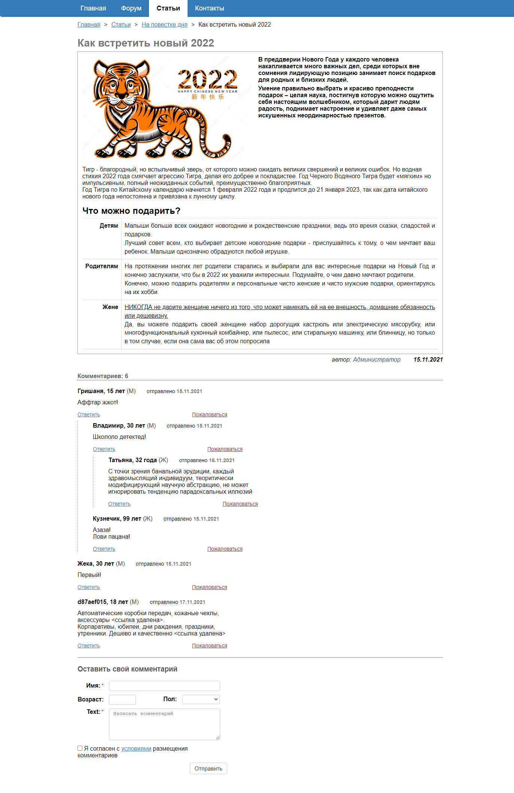

# Вёрстка страницы

По прикрепленному макету необходимо сверстать страницу. Весь код необходимо залить на gitea, как и предыдущие домашние задания.

___

**Замечание по выполнению задания:**

При стилизации компонентов запрещено использовать flex.

___

