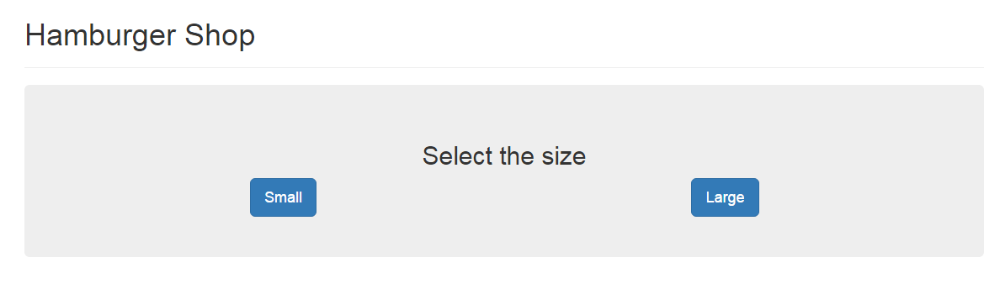
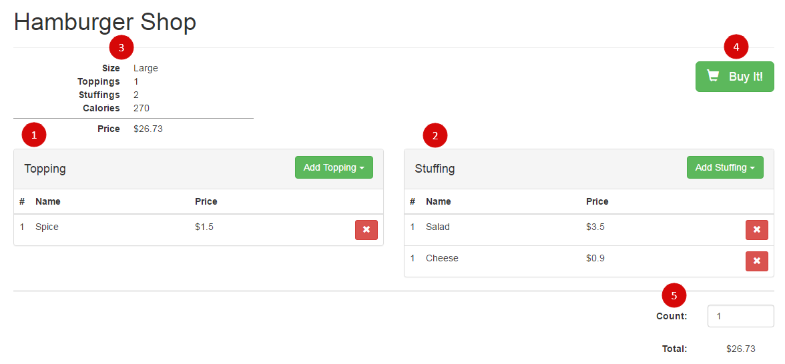
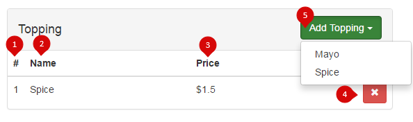
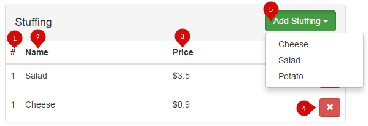
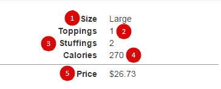
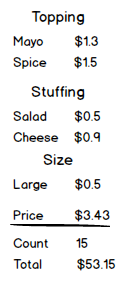
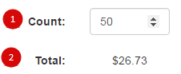

# Hamburger Shop

Реализация поведения страницы онлайн-магазина "*Hamburger Shop*"

## Содержание

* [Описание интерфейса](#interface)
  * [Выбор размера](#size-chooser)
  * [Рабочая область](#workspace)
     * [Блок 1. Таблица "Topping"](#block-1)
     * [Блок 2. Таблица “Stuffing”](#block-2)
     * [Блок 3. Информационный блок](#block-3)
     * [Блок 4: Кнопка “Buy it!”](#block-4)
     * [Блок 5: Итоговая информация](#block-5)
* [Требования к решению](#requirements)

<div id="interface"></div>

## Описание интерфейса

<div id="size-chooser"></div>

### Выбор размера
При открытии страницы отображается текст `Select the size`, также две кнопки `Small` и `Large`,
обозначающие размеры гамбургера. Каждый размер имеет свою цену и калорийность.



*Рис 1. Блок выбора размера*

При нажатии на одну из кнопок отображается [Рабочая область](#workspace) с выбранным размером, согласно нажатой кнопке.
Область "Выбор Размера" скрывается.

<div id="workspace"></div>

### Рабочая область



*Рис. Рабочая области наполнения гамбургера с выбранными несколькими начинками.*

При переходе с выбора размера на данную область отображаются следующие блоки:

1. [таблица `Topping`](#block-1)
2. [таблица `Stuffing`](#block-2)
3. [информационный блок ](#block-3)
4. [кнопка `Buy It!`](#block-4)
5. [итоговая информация](#block-5)

<div id="block-1"></div>

#### Блок 1. Таблица "Topping"



Содержит информацию о добавляемых топпингах в гамбургер.

Таблица имеет название “Topping”.

Добавленные топпинги отображаются в таблице в виде строк таблицы, которые содержат следующие элементы:


| # | Название | Описание |
|---| ---------| -------- |
| 1.1 | Номер | Порядковый номер добавленного топпинга в таблице |
| 1.2 | Название | Название добавленного топпинга. |
| 1.3 | Цена топпинга | Цена в формате `$n.nn` |
| 1.4 | Удалить | Кнопка с иконкой `Х`.<br> По нажатию на нее удаляется соответствующая строка таблицы. После удаления происходит пересчет информации в [Блоке 3. Информационный блок](#block-3) и итоговой цены в [Блоке 5: Итоговая информация](#block-5). |
| 1.5 | Выпадающий список | Содержащий доступные для выбора топпинги. |

По умолчанию таблица отображается пустой.

Добавление топпинга в гамбургер осуществляется с помощью кнопки `Add Topping` под номером **1.5**.
 
При нажатии на кнопку, отображается выпадающий список с возможными топпингами.

Топпинги перечисляются в алфавитном порядке имени.

При нажатии на топпинг из выпадающего списка, он добавляется в таблицу и осуществляется пересчет информации
(калорий, цены, кол-ва топпингов и начинок) в [Блоке 3. Информационный блок](#block-3)
и итоговой цены за указанное количество гамбургеров в [Блоке 5: Итоговая информация](#block-5).

После добавления топпинг пропадает из выпадающего меню.<br>
При добавлении всех топпингов из выпадающего меню, кнопка `Add Topping` становится недоступной для нажатия.
Кнопка становится доступной, когда есть доступные для выбора топпинги.

<div id="block-2"></div>

#### Блок 2. Таблица “Stuffing”



Содержит информацию о добавляемых начинках в гамбургер.

Таблица имеет название “Stuffing”.

Добавленные начинки отображаются в таблице в виде строк, которые содержат следующие элементы:

| # | Название | Описание |
|---| ---------| -------- |
| 2.1 | Номер | Порядковый номер добавленной начинки |
| 2.2 | Название | Название начинки |
| 2.3 | Цена топпинга | Цена отображается в формате `$n.nn` |
| 2.4 | Удалить | Кнопка с иконкой `Х`.<br> По нажатию на нее удаляется соответствующая строка таблицы. После удаления происходит пересчет информации в [Блоке 3. Информационный блок](#block-3) и итоговой цены в [Блоке 5: Итоговая информация](#block-5). |
| 2.5 | Выпадающий список | Содержащий доступные для выбора начинки. |

По умолчанию таблица отображается пустой.

Добавление начинки в гамбургер осуществляется с помощью кнопки `Add Stuffing` под номером **2.5**. 

При нажатии на кнопку, отображается выпадающий список с доступными начинками.

Начинки перечисляются в алфавитном порядке имени.

При нажатии на начинку из выпадающего списка, она добавляется в таблицу и осуществляется пересчет информации
(калорий, цены, кол-ва топпингов и начинок) [Блоке 3. Информационный блок](#block-3)
и итоговой цены за указанное количество гамбургеров в [Блоке 5: Итоговая информация](#block-5).

После добавления начинка пропадает из выпадающего меню.
При добавлении всех начинок из выпадающего меню или при превышения допустимого количества начинок,
кнопка `Add Stuffing` становится недоступной для нажатия.
Кнопка становится активной, когда есть доступные для выбора начинки.

<div id="block-3"></div>

#### Блок 3. Информационный блок



Содержит информацию о добавленных начинках и топпингах, также информацию о размере гамбургера, его цене и калориях.
При добавлении/удалении начинки или топпинга происходит перерасчет
калорий, цены, количества добавленных начинок и топпингов.

| # | Название | Описание |
|---| ---------| -------- |
| 3.1 | Размер | Выбранный размер пользователем. Каждый размер имеет свою цену и калорийность |
| 3.2 | Количество топпингов | Отображается количество добавленных топпингов в гамбургер |
| 3.3 | Количество начинок | Отображается количество добавленных начинок в гамбургер |
| 3.4 | Калории | Отображается сумма калорий всех ингредиентов гамбургера + калории в зависимости от от выбранного размера. |
| 3.5 | Цена | Отображается стоимость одного гамбургера.<br>Цена отображается в формате `$n.nn`. Цена состоит из суммы цен всех ингредиентов + цена в зависимости от выбранного размера. |

<div id="block-4"></div>

#### Блок 4: Кнопка “Buy it!”

При нажатие на кнопку `Buy it!` происходит формирование “**чека**” для пользователя с информацией о том,
что и в каком количество он заказал.

Чек отображается под всеми блоками или в модальном окне поверх текущей страницы.

Содержимое чека разбито на секции:
* Перечисление топпингов с их ценами.<br>
  Не отображается, если не было добавлено ни одного топпинга.
* Перечисление начинок с их ценами.<br>
  Не отображается, если не было добавлено ни одной начинки
* Информация о размере:<br>
  название выбранного размера и его цена.
* Цена одного гамбургера с учетом размера, всех добавленных топпингов и начинок.
* Количество заказываемых гамбургеров.
* Итоговая цена.

Цены отображаются в формате `$n.nn`.

Итоговая цена рассчитывается по формуле:

```
Total = цена_за_один_гамбургер * количество_гамбургеров.
```

Пример отображения*:



*(\*) Примечание: данное иллюстрация является только макетом, показывающим какие данные необходимо отображать в чеке.*

<div id="block-5"></div>

#### Блок 5: Итоговая информация

Содержит в себе выбор заказываемого количества гамбургеров и итоговую цену за все гамбургеры.



**5.1**. Поле ввода “Количество заказываемых гамбургеров”.
* Числовое поле ввода.
* По умолчанию значение равно **1**.
* Пользователь может его изменить с помощью стрелочек или вводя вручную число.
* Минимальное значение, которое может ввести пользователь, равно **1**.<br>
  При вводе значения меньше, оно сбрасывается до минимального, т.е. до 1.
* Максимальное значение, которое может ввести пользователь, равно **50**.<br>
  При превышении этого числа, значение сбрасывается на максимальное, т.е. до 50.
* После потери фокуса, пересчитывается итоговая цена с учетом выбранного количества гамбургеров.

**5.2**. Итого.

Итоговая цена пересчитывается каждый раз при:
* изменении цены за один гамбургер;
* изменении количества гамбургеров.

Итоговая цена рассчитывается по формуле:

```
Total = цена_за_один_гамбургер * количество_гамбургеров.
```

Отображается в формате `$n.nn`.

<div id="requirements"></div>

## Требования к решению

Решение должно быть самодостаточным и полностью рабочим вариантом. Поэтому PR должен включать следующие файлы:

1. папка `vendor` со всем содержимым;
2. файл `index.html` с версткой и элементами.
   * Начальное содержимое всех элементов, в которых отображается информация, должно быть пустым.
   * Данные заполняются динамически через JavaScript.
   * Все необходимые `.js` файлы подключаются через тег `<script>` в разделе `<head>`.
3. файл `hamburger.js` с кодом функции-конструктора `Hamburger` из предыдущего задания;
4. свои `*.js` файлы с исходными кодом реализация задания.
