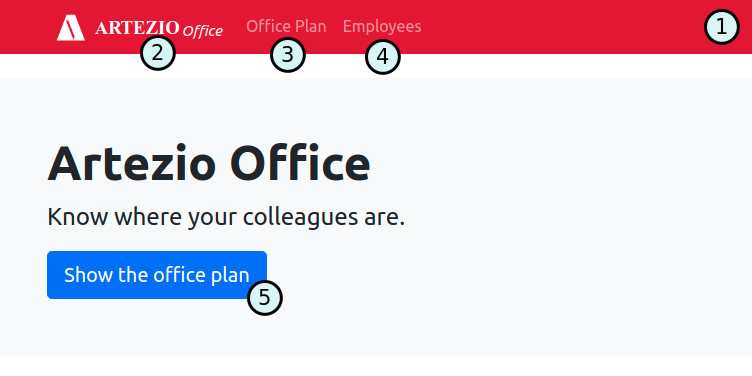
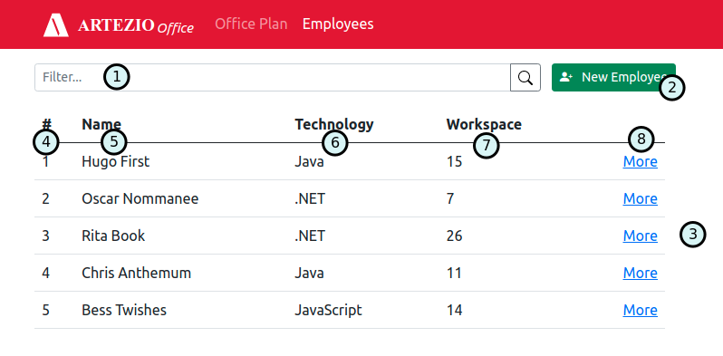
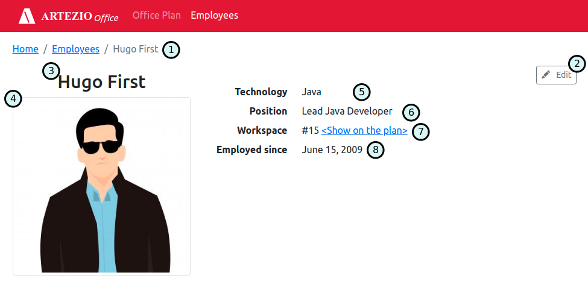
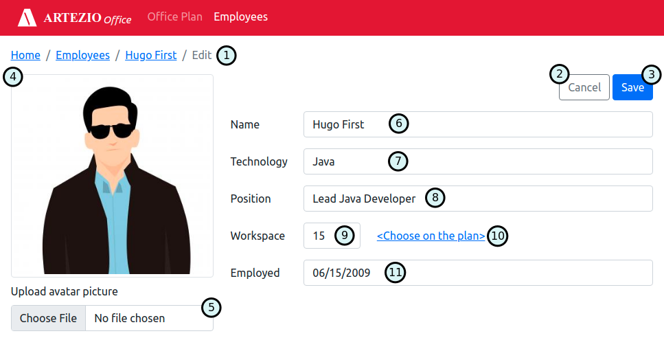
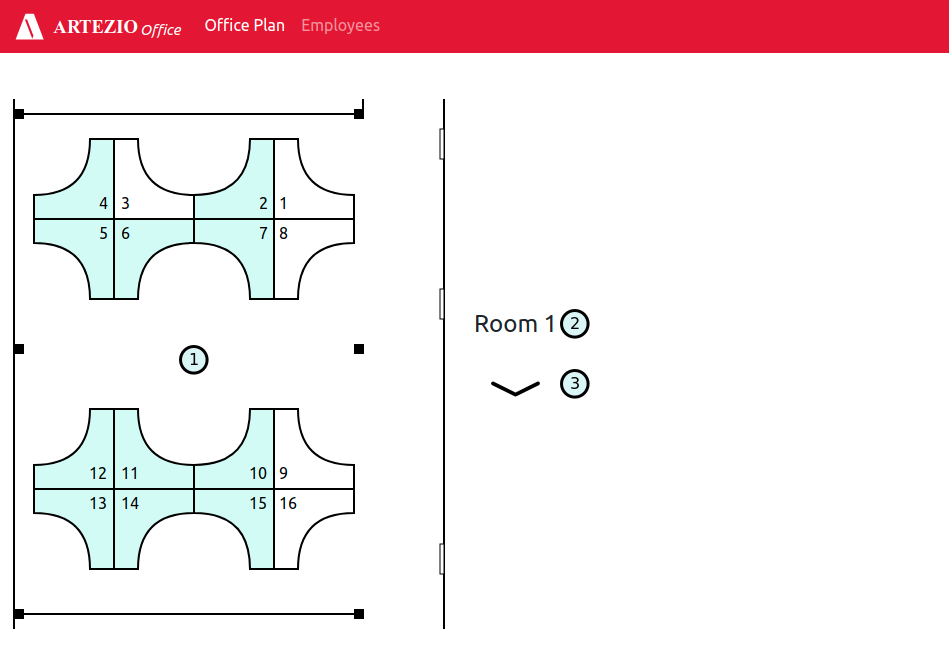
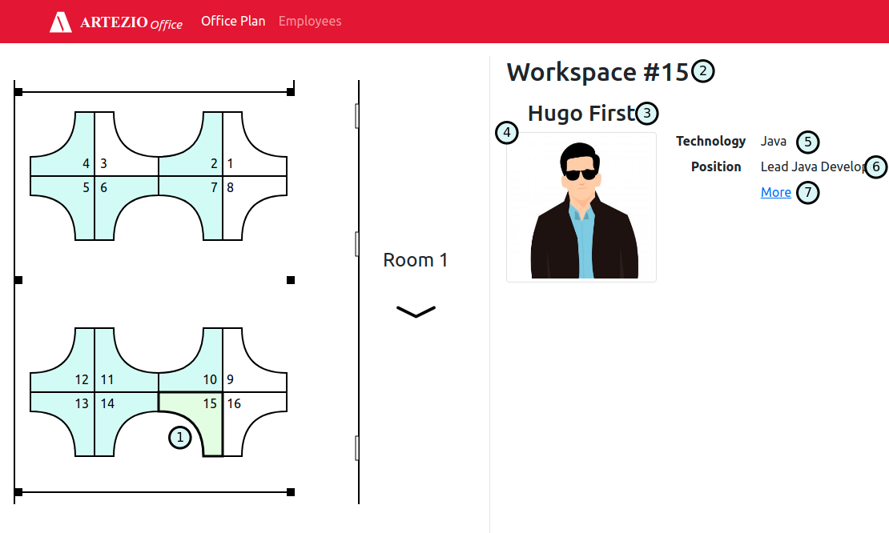

# Artezio Office Plan [Документация]

Описание отображения и поведения всех элементов интерфейса приложения.

## Содержание

* [1. Главная страница](#main-page)
* [2. Сотрудники](#employees)
* [3. Информация о сотруднике](#employee-information)
* [4. Редактирование сотрудника](#employee-edit)
* [5. Добавление нового сотрудника](#employee-new)
* [6. План офиса](#office-plan)
* [7. План офиса — отображение выбранного рабочего места](#office-plan-selected)

## 1. Главная страница

*Рис 1. Главная страница*

Главная страница отображается при переходе по корневому пути приложения.

Таблица с описанием элементов главной страницы:

| # | Название | Тип | Описание                                                                                  |
|---| -------- | --- |-------------------------------------------------------------------------------------------|
| 1 | Главное меню | Панель меню | Панель с главным меню является "шапкой" приложения и отображается на каждой странице      |
| 2 | ARTEZIO Office | Картинка/Ссылка | Логотип приложения / Ссылка, при клике на которую происходит переход на главную страницу  |
| 3 | Office Plan | Пункт меню | Ссылка, при клике на которую происходит переход на страницу ["Office Plan"](#office-plan) |
| 4 | Employees | Пункт меню | Ссылка, при клике на которую происходит переход на страницу ["Employees"](#employees)     |
| 5 | Show the office plan | Кнопка | При клике происходит переход на страницу ["Office Plan"](#office-plan)                    |

## 2. Сотрудники

При переходе на страницу *"Сотрудники"* происходит подгрузка и отображение списка всех сохраненных сотрудников.

*Рис 2. Страница со списком сотрудников*

Таблица с описанием элементов страницы "Employees":

| # | Название | Тип | Описание |
|---| -------- | --- | -------- |
| 1 | Фильтр | Поле ввода | При вводе значения, содержимое элемента "**3**. Список сотрудников" фильтруется по частичному совпадению введенного текста и полей *Name* или *Technology*.   По умолчанию отображается подсказка "Filter by name or technology..." |
| 2 | + New Employee | Кнопка/Ссылка | При клике происходит переход на страницу с формой добавления нового сотрудника |
| 3 | Список сотрудников | Таблица | Отображается список всех добавленных сотрудников, учитывая значение фильтра в элементе **1** |
| 4 | # | Колонка таблицы | Отображается системный номер записи о сотруднике (идентификатор) |
| 5 | Name | Колонка таблицы | Отображается полное имя сотрудника в формате *"Имя Фамилия"* |
| 6 | Technology | Колонка таблицы | Отображается технология сотрудника |
| 7 | Workspace | Колонка таблицы | Отображается номер рабочего места |
| 8 | More | Колонка таблицы | Ячейки содержат текст `More` в виде ссылки, при клике на которую происходит переход на страницу просмотра подробной информации о сотруднике (см. раздел [Информация о сотруднике](#employee-information)) |

## 3. Информация о сотруднике

Страница отображается при переходе как по ссылке со страницы "Список сотрудников",
так и по прямой ссылке.

*Рис 3. Страница с просмотром информации и сотруднике*

Таблица с описанием элементов страницы "Employee":

| # | Название | Тип | Описание |
|---| -------- | --- | -------- |
| 1 | Меню | Меню "*хлебные крошки*" | Содержит навигацию текущей вложенности страниц в виде ссылок.   Формат `Home / Employees / ИМЯ ФАМИЛИЯ текущего сотрудника`.|
| 2 | Edit | Кнопка | Инициирует переход на страницу редактирования сотрудника |
| 3 | Name | Заголовок | Отображается полное имя сотрудника в формате `Имя Фамилия` |
| 4 | Фото | Картинка | Отображается текущая сохраненная картинка в качестве аватара сотрудника |
| 5 | Technology | Текст | Отображается текущая технология сотрудника |
| 6 | Position | Текст | Отображается текущая должность сотрудника |
| 7 | Workspace | Текст | Отображается номер рабочего места.  При клике на ссылку `<Show on the plan>`, происходит переход на страницу "Office Plan", при этом указанное рабочее место по умолчанию выбрано. |
| 8 | Employed since | Текст | Отображается дата принятия сотрудника на работу в формате `НАЗВАНИЕ_МЕСЯЦА ДЕНЬ, ГОД` |

## 4. Редактирование сотрудника

Страница отображается как по клике на кнопку "Edit" на странице "Информация о сотруднике",
так и при переходе по прямой ссылке.

*Рис 4. Страница с формой редактирования сотрудника*

Таблица с описанием элементов страницы "Edit":

| # | Название | Тип | Описание                                                                                                                                                                                                                                                                                                                                              |
|---| -------- | --- |-------------------------------------------------------------------------------------------------------------------------------------------------------------------------------------------------------------------------------------------------------------------------------------------------------------------------------------------------------|
| 1 | Меню | Меню "*хлебные крошки*" | Содержит навигацию текущей вложенности страниц в виде ссылок.   Формат `Home / Employees / <Имя Фамилия> текущего сотрудника / Edit`.                                                                                                                                                                                                              |
| 2 | Cancel | Кнопка | Инициирует отмену редактирования данных, не сохраняя текущие изменения. Производит переход на страницу просмотра информации о сотруднике.                                                                                                                                                                                                             |
| 3 | Save | Кнопка | Инициирует запрос на сохранение изменений.   При возникновении ошибки сохранения отображается модальное окно с текстом ошибки. Если сохранение прошло успешно, то производится переход на страницу отображения обновленной информации о сотруднике.   По умолчанию - **неактивна**. Становится активной, если во все поля были введены значения |
| 4 | Фото | Картинка | Отображается ранее сохраненное изображение. Если в элементе "**5**. Upload avatar picture" был выбран файл изображения, то отображается содержимое этого файла.                                                                                                                                                                                       |
| 5 | Upload avatar picture | Выбора файла | Открывает стандартное окно выбора файла. Для выбора доступны только `.jpg`, `.jpeg` и `.png` файлы.                                                                                                                                                                                                                                                   |
| 6 | Name | Текстовое поле ввода | Масимальная длина: **200** символов                                                                                                                                                                                                                                                                                                                   |
| 7 | Technology | Выпадающий список | Содержит следующие доступные для выбора значения: <ul> <li> Java <li> JavaScript <li> .NET <li> QA </ul> По умолчанию - выбрано ранее сохраненное значение.                                                                                                                                                                                           |
| 8 | Position | Текстовое поле ввода | Максимальная длина: **100** символов                                                                                                                                                                                                                                                                                                                  |
| 9 | Workspace | Выпадающий список | Для выбора доступны только номера свободных рабочих мест.                                                                                                                                                                                                                                                                                             |
| 10 | Employed | Поле ввода даты  | Формат ввода даты: `ММ/ДД/ГГГГ`                                                                                                                                                                                                                                                                                                                       |

* Все поля ввода являются обязательными для заполнения
* Если после в поле ввода потери фокуса находится недопустимое для него значение, то под полем ввода отображение текст с описанием невыполненного критерия. 

## 5. Добавление нового сотрудника

Описание и поведение аналогично форме из раздела [4. Редактирование сотрудника](#employee-edit) кроме следующих изменений:

1. Все элементы ввода данных по умолчанию пустые.
1. Элемент `1. Меню "Хлебные крошки"` имеет вид `Home / Employees / New`.
1. Элемент `2. Cancel` производит переход на страницу ["2. Список сотрудников"](#employees).

## 6. План офиса

*Рис 5. Страница "План офиса"*

Таблица с описанием элементов страницы "Office Plan":

| # | Название | Тип | Описание |
|---| -------- | --- | -------- |
| 1 | Схема комнаты | SVG | Интерактивная схема-план комнаты офиса |
| 2 | Room # | Текст | Название текущей отображаемой комнаты |
| 3 | Next Room | Иконка/Кнопка | Инициирует переключение отображения плана следующей комнаты |

При выборе рабочего место на схеме (элемент **1**) в правой части отображается краткая информация о сотруднике.

## 7. План офиса — отображение выбранного рабочего места

*Рис 5. Выбранное на схеме рабочее место.*

Таблица с описанием элементов:

| # | Название | Тип | Описание |
|---| -------- | --- | -------- |
| 1 | Элемент схемы | SVG | Текущее выбранное рабочее место дополнительно подсвечивается рамкой и цветом |
| 2 | Workspace # | Заголовок | Отображается номер выбранного рабочего места.   Если выбранное рабочее месте не занято, то отображается надпись `Workspace #<НОМЕР> unoccupied`. Нижележащий блок с данными сотрудника в таком случае не отображается. |
| 3 | Имя | Текст | Полное имя сотрудника в формате `Имя Фамилия` |
| 4 | Аватар | Картинка | Сохраненное фото сотрудника  |
| 5 | Technology | Текст | Технология сотрудника  |
| 6 | Position | Текст | Должность сотрудника |
| 7 | More | Ссылка | Инициирует переход на страницу с подробной информацией о сотруднике (см. раздел [3. Информация о сотруднике](#employee-information)) |
